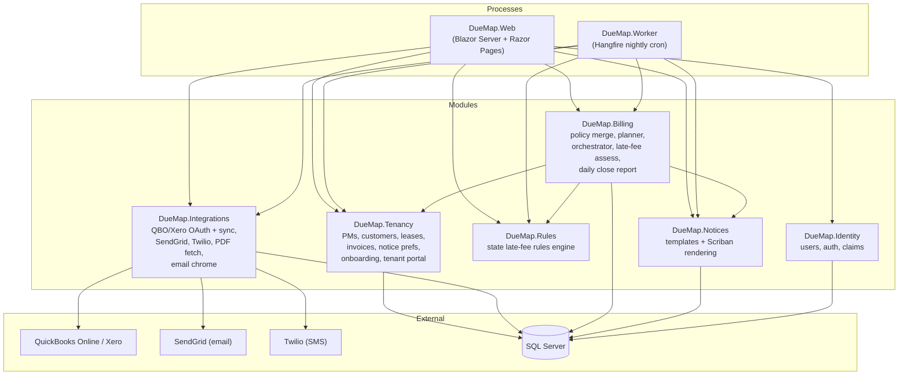
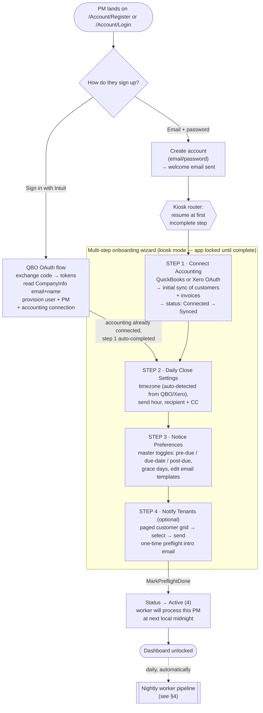
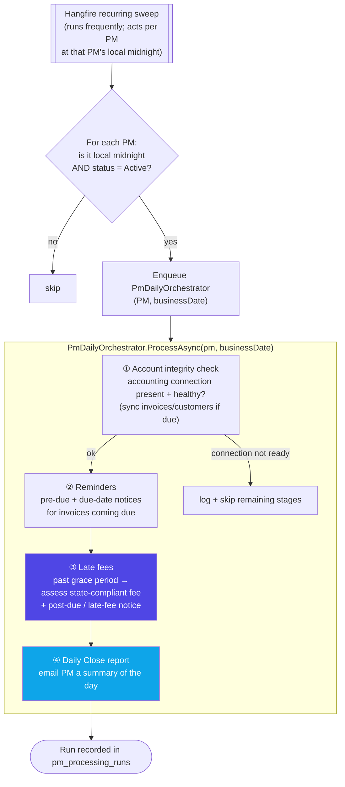
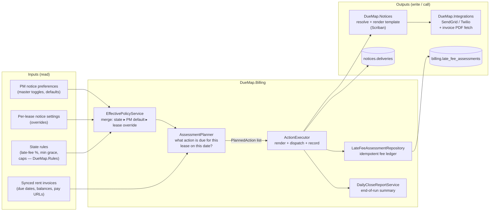
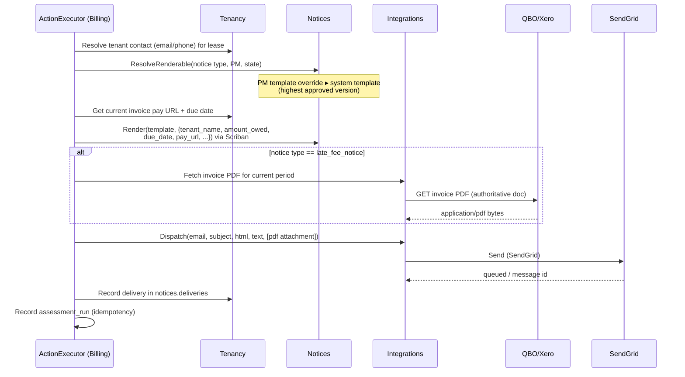
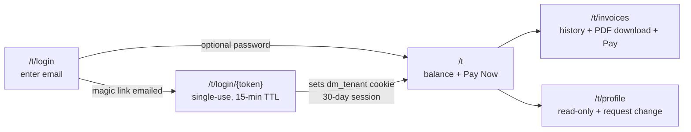
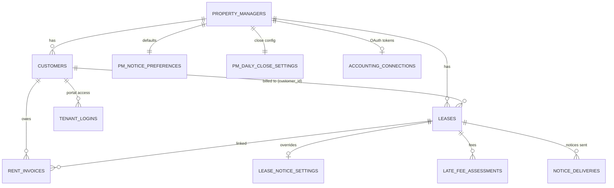

# DueMap — Application Overview & Flow

> A team-discussion reference describing what DueMap does today, how a property
> manager moves through it, where the nightly worker fits, and how the billing
> engine sits in the middle. Diagrams are [Mermaid](https://mermaid.js.org/) —
> they render on GitHub, in VS Code (with a Mermaid extension), and in most
> Markdown viewers.

---

## 1. What DueMap is

DueMap automates **rent reminders, state-compliant late fees, and tenant
notifications** on top of the accounting system a property manager (PM) already
uses — **QuickBooks Online** or **Xero**. The PM never migrates their books; we
read customers + invoices each day and act on them.

**The core promise:** "Connect your accounting system once. We handle the
nightly busywork — reminding tenants before rent is due, assessing
legally-compliant late fees when it isn't paid, and emailing you a daily
summary."

### Who uses it

| Persona | What they do in DueMap |
| --- | --- |
| **Property Manager (PM)** | Connects QBO/Xero, sets reminder + late-fee preferences, reviews the daily close. The primary customer. |
| **Tenant** | Receives reminder / late-fee emails; can sign into a lightweight portal to view balance, pay, and download invoices. |
| **Platform admin (us)** | Monitors the worker via a Basic-Auth-gated log viewer + the Hangfire dashboard. |

---

## 2. Module architecture

DueMap is a modular monolith — one solution, clean module boundaries, two
runnable processes (Web + Worker) that load the **same** module set so behavior
is identical regardless of which process calls a service.



**Key boundary rules**

- **Billing** is the brain. It merges policy, plans actions, and executes them — but it never talks to QBO/Xero or SendGrid directly. It calls **Integrations** (for dispatch + invoice PDF) and **Notices** (for template rendering).
- **Integrations** owns every third-party adapter. Swapping SendGrid for SES, or adding a new accounting provider, touches only this module.
- **Tenancy** owns the domain data (PMs, customers, leases, invoices) and is the only module that writes those tables.
- Web + Worker share the module list. Anything the worker does at midnight, the web app could trigger on demand (and does, for the onboarding sync).

---

## 3. Sign-up → setup → first notification (the PM journey)

There are **two entry paths** into onboarding, both landing in the same
multi-step wizard.



**Onboarding status flags** (`tenancy.property_managers.onboarding_status`):

| Value | Name | Meaning |
| --- | --- | --- |
| 1 | Registered | Account exists, no accounting connection |
| 2 | Connected | OAuth tokens persisted |
| 3 | Synced | First customer/invoice pull succeeded |
| 4 | **Active** | Fully onboarded — **the worker only processes PMs at status 4** |

Each wizard step also stamps its own completion timestamp
(`step_connect_done_at`, `step_close_done_at`, `step_notice_prefs_done_at`,
`step_preflight_done_at`) so a PM who leaves mid-flow resumes exactly where they
left off. "Sign in with Intuit" pre-stamps step 1 because the OAuth grant
established the accounting connection during sign-up.

---

## 4. The nightly worker — once-daily cron, per PM at local midnight

The worker is a Hangfire recurring job. A **sweep** runs on a schedule, finds
every Active PM whose local clock has just crossed midnight, and enqueues a
per-PM **orchestrator** run. Each run is a 4-stage pipeline.



**Idempotency & resilience**

- Each (PM, business-date) run claims a slot in `pm_processing_runs`; a duplicate enqueue short-circuits ("already processed").
- Each per-lease action is keyed in `assessment_runs` by (lease, due-date, action kind) — re-running a day never double-sends or double-charges.
- The Daily Close email is chained as a Hangfire **continuation** of the orchestrator, so it always carries that day's totals.
- Every log line carries `PmId` / `RunId` / `BusinessDate` scope and lands in `logs.events` for the admin log viewer.

---

## 5. Where billing sits — the decision + action engine

"Billing" here doesn't mean charging the PM money. It's the engine that decides
**what to do for each lease today** and **executes** it. It's the connective
tissue between the rules engine, the tenant data, and the notification adapters.



**The merge order** (EffectivePolicyService) — most specific wins:

```
State rule (legal floor/ceiling)  ▸  PM portfolio default  ▸  Per-lease override
```

State law is a **guardrail**, not just a default: if a PM sets a 2-day grace
period but the state mandates a 5-day minimum, the engine uses 5. This is the
core compliance value of the product.

---

## 6. The notification itself — render → dispatch → record

When the ActionExecutor decides "send a late-fee notice to lease #42", here's
what happens:



**Notice copy today** (system templates, PM-overridable):

- **Pre-due reminder** — friendly nudge N days before due, with Pay Now button.
- **Due-date reminder** — morning-of reminder, Pay Now button.
- **Grace-period reminder** — past due but inside grace; "pay to avoid a fee."
- **Late-fee notice** — fee applied; **the actual QBO/Xero invoice PDF is attached**, Pay Now button, and an "ignore if already paid" line. No "reply to this email" language.

All transactional emails (welcome, magic link, preflight) share one branded
chrome via `TransactionalEmailBuilder`.

---

## 7. Tenant portal (`/t/*`)

A lightweight, co-branded surface for tenants — separate auth, separate layout.



- **Auth**: magic link (default) + optional password. Tokens hashed at rest, constant-time compare, anti-enumeration.
- **Pay Now**: links to the QBO/Xero hosted payment page (we never touch card data).
- **PDF download**: fetched live from the accounting system, scoped to the signed-in tenant's own invoices.

---

## 8. Admin & ops surfaces

| Surface | Auth | Purpose |
| --- | --- | --- |
| `/admin/worker-logs` | Basic Auth (dev creds) | Structured worker log stream, filterable by PM / severity / time window |
| `/hangfire` | Authenticated user | Job queue, trigger sweeps, inspect failures |
| `/health` | Anonymous | Liveness probe |

---

## 9. Data model (the tables that matter)



- **`customers`** = synced from QBO/Xero (who pays). **`leases`** = DueMap's own concept (the agreement: rent, state, dates) — the attachment point for rules + notices. One customer ↔ one lease in the common case.
- **`accounting_connections`** holds encrypted OAuth tokens (Data Protection); Web and Worker share the keyring.
- **`logs.events`** (separate schema) is the worker's structured log sink.

> **Known UX rough edge under discussion:** the split between the **Leases** and
> **Link Customers** screens exposes this `customers`↔`leases` duality to the PM,
> which feels awkward. A proposed redesign collapses both into a single
> **Tenants** screen where lease data is an inline property of each synced
> customer. Not yet built — flagged for the team conversation.

---

## 10. Tech stack

| Concern | Choice |
| --- | --- |
| Runtime | .NET 8 |
| Web UI | Blazor Server (app) + Razor Pages (auth surfaces) |
| Styling | Tailwind CSS v4 |
| Background jobs | Hangfire (SQL Server storage) |
| Database | SQL Server (LocalDB in dev) |
| Accounting | QuickBooks Online + Xero (OAuth 2.0) |
| Email / SMS | SendGrid / Twilio |
| Template rendering | Scriban |
| Logging | Serilog → console + `logs.events` table |
| Token encryption | ASP.NET Core Data Protection |
| Schema migrations | Append-only `db/duemap_schema_v*.sql`, auto-applied in dev by `DevSchemaBootstrap` |

---

## 11. End-to-end, in one sentence per stage

1. **Sign up** — PM registers with email or "Sign in with Intuit" (which connects QBO in the same step).
2. **Connect** — OAuth to QuickBooks/Xero; we pull customers + invoices.
3. **Configure** — daily-close timezone/time, reminder + late-fee preferences, email templates.
4. **Introduce** — optional one-time preflight email to tenants.
5. **Go active** — status flips to Active; the PM's dashboard unlocks.
6. **Every night** — the worker, at the PM's local midnight, checks connection health, sends due reminders, assesses state-compliant late fees, and emails the PM a daily close.
7. **Tenants** — receive branded reminder/late-fee emails (late fees carry the real invoice PDF + a Pay Now link) and can self-serve in the portal.
8. **Billing engine** — sits between the rules, the tenant data, and the notification adapters, deciding and executing what each lease needs each day.

---

*Generated as a point-in-time snapshot for team discussion. The codebase is
under active development; treat this as "as of now," not a spec.*
